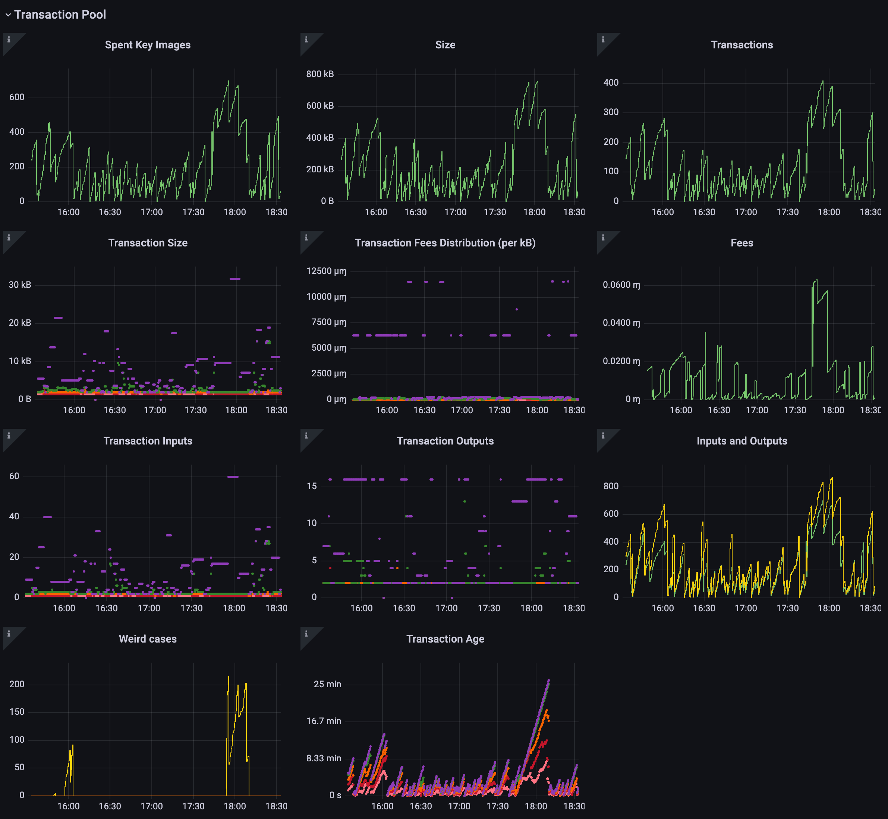
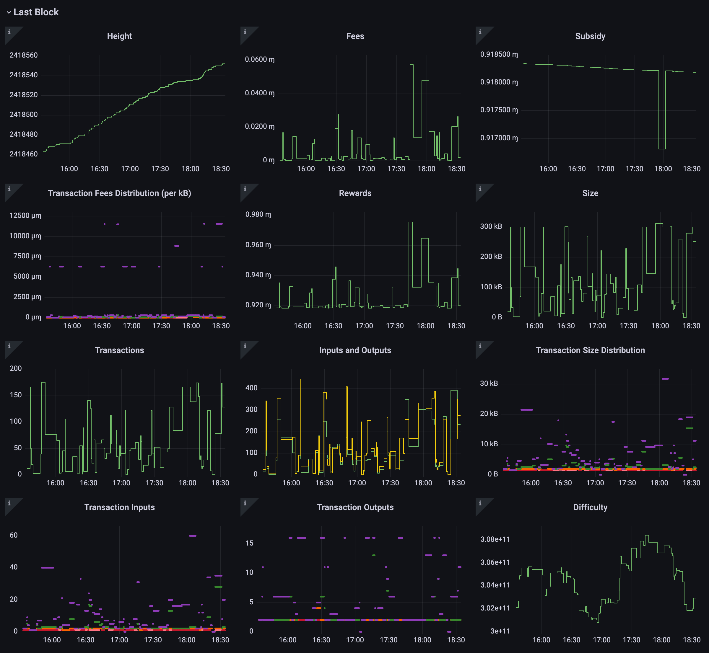
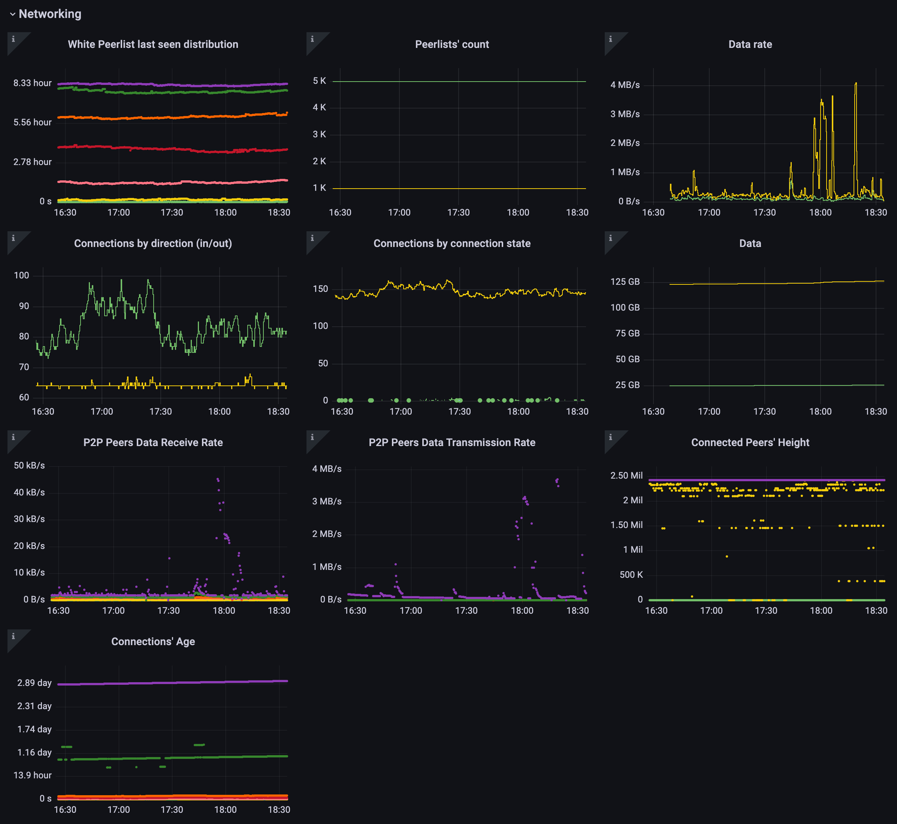
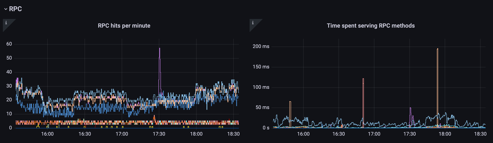

# monero-exporter

[prometheus] exporter for [monero] nodes.


<!-- START doctoc generated TOC please keep comment here to allow auto update -->
<!-- DON'T EDIT THIS SECTION, INSTEAD RE-RUN doctoc TO UPDATE -->


- [About](#about)
- [Installation](#installation)
- [Grafana](#grafana)
- [Example](#example)
- [Metrics](#metrics)
  - [Last block](#last-block)
  - [Transaction pool](#transaction-pool)
  - [RPC](#rpc)
  - [P2P Connections](#p2p-connections)
  - [Peerlist](#peerlist)
  - [Net Stats](#net-stats)
  - [Info](#info)
- [License](#license)
- [Donate](#donate)

<!-- END doctoc generated TOC please keep comment here to allow auto update -->

## About

`monero-exporter` is a single multiplatform binary that extracts metrics out of
a running [monero] node, allowing one to better observe the state of its own
daemon and the network as seen by it.

```console
$ monero-exporter --help

Prometheus exporter for monero metrics

Usage:
  monero-exporter [flags]

Available Commands:
  completion  generate the autocompletion script for the specified shell
  help        Help about any command
  version     print the version of this CLI

Flags:
      --bind-addr string        address to bind the prometheus server to 
                                (default ":9090")
      --geoip-filepath string   filepath of a geoip database file for ip to 
                                country resolution
  -h, --help                    help for monero-exporter
      --monero-addr string      address of the monero instance to collect info 
                                from (default "http://localhost:18081")
      --telemetry-path string   endpoint at which prometheus metrics are served 
                                (default "/metrics")

Use "monero-exporter [command] --help" for more information about a command.
```

It works by issuing remote procedure calls (RPC) to a monero node and based on
the responses it gets, exposing metrics to a Prometheus server querying
`monero-exporter`.


```

  PROMETHEUS  ---- get /metrics -->---.
      ^                               |
      |                               |
      |                         MONERO-EXPORTER --- get /jsonrpc --> MONEROD
      |                               |
      |                               |
      '-------------<-- samples ------'

```

Typically, `monero-exporter` is just one piece of the stack though. A complete
setup usually looks like:

- `monerod`, the monero daemon, is running exposing its daemon RPC for those
  interested in it (see [monero-project/monero])
- `monero-exporter` targets that `monerod` RPC port
- [prometheus], configured to scrape `monero-exporter`, asks it for metric
  samples, then stores those in its internal timeseries database
- [grafana] then queries that timeseries data using the [promql], displaying
  that in dashboards, alerting on thresholds, etc


```
            
  (ui)            GRAFANA
                     .
                     .
                   queries                 ..every dashboard refresh interval..
                     .
                     .
                     .       
  (ts db)        PROMETHEUS --- scrape ->-.           ..every scrape interval..
                     ^                    |
                     |                    |
                     |                    |
  (exporter)         '--------------MONERO-EXPORTER
                                          .
                       ...... rpc .........                       ..on scrape..
                       .
                       .
  (daemon)          MONEROD

```


## Installation

You can either install it by using [Go], building the latest tagged release
from scratch

```bash
GO111MODULE=on \
  go get github.com/cirocosta/monero-exporter/cmd/monero-exporter
```

or fetching the binary for your corresponding distribution from the [releases
page]. 

See [INSTALL.md] for details and examples.


## Grafana

This repository includes a sample dashboard that makes use of the metrics
exposed via this exporter (see [./grafana](./grafana)).

Some screenshots of it:






_ps.: DO NOT publicly run the example Grafana setup without tweaking the
configuration - it is way more permissive than you'd want a Grafana instance
to be._


## Example

Under [./examples](./examples) you'll find a setup that makes use of
[docker-compose] to bring up Prometheus, Grafana, and monero-exporter
targetting an already running monero daemon (see
[docker-compose.yaml](./examples/docker-compose.yaml)).

To run it, make sure you have `docker` and `docker-compose` installed. That
done, run:

```bash
# get inside the examples directory
#
cd ./examples


# brings the services (monerod, monero-exporter, grafana, and prometheus) up
# in the background
#
docker-compose up -d


# follow the logs from those services
#
docker-compose logs -f
```


## Metrics

Below you'll find the description of the metrics exposed by `monero-exporter`
that are retrieved by a prometheus server, stored in its timeseries database,
and made available for querying by something like Grafana.

Keep in mind that Prometheus gather metrics in a pull-based fashion (see ["Why
do you pull rather than push?"]), and as such, metric samples are based on
information seen at the time that prometheus reached out to the exporter.

While the pull-based approach is very useful for looking at long timeframes and
large number of hosts, it's not very suitable for realtime data (for that,
consider other implementations for push-based systems like [InfluxDB]).


### Last block

This set of metrics is extracted from information gathered regarding the last
block seen by the node at the moment that Prometheus scraped samples from
`monero-exporter`.

Think of it as _"at time X, when I looked at the last block, these were the
pieces of information I could gather from it"_, which when looked at over time
(say, 30d), gives you a pretty good picture of what "all" (more like, _most_)
blocks looked like as long as the interval between those scrapes where short
enough (i.e., in between the mean time for a block to be mined - 2min as of
today).


| name | description |
| ---- | ----------- |
| monero_lastblock_difficulty | difficulty used for the last block |
| monero_lastblock_fees_micronero_per_kb | distribution of the feeperkb utilized for txns |
| monero_lastblock_fees_monero | total amount of fees included in this block |
| monero_lastblock_height | height of the last block |
| monero_lastblock_reward_monero | total amount of rewards granted in the last block (subsidy + fees) |
| monero_lastblock_size_bytes | total size of the last block |
| monero_lastblock_subsidy_monero | newly minted monero for this block |
| monero_lastblock_transactions | number of transactions seen in the last block |
| monero_lastblock_transactions_inputs | distribution of inputs in the last block |
| monero_lastblock_transactions_outputs | distribution of outputs in the last block |
| monero_lastblock_transactions_size_bytes | distribution of the size of the transactions included |


### Transaction pool

These metrics give you a view of how the transaction pool of this particular
node looked like when Prometheus asked the exporter information about it.

Given the pull-based nature of Prometheus, this will be only as granular as the
frequency of scraping configured for it.


| name | description |
| ---- | ----------- |
| monero_transaction_pool_double_spends | transactions doubly spending outputs |
| monero_transaction_pool_failing_transactions | number of transactions that are marked as failing |
| monero_transaction_pool_fees_micronero_per_kb | distribution of the feeperkb utilized for txns in the pool |
| monero_transaction_pool_fees_monero | total amount of fee being spent in the transaction pool |
| monero_transaction_pool_not_relayed | number of transactions that have not been relayed |
| monero_transaction_pool_older_than_10m | number of transactions that are older than 10m |
| monero_transaction_pool_size_bytes | total size of the transaction pool |
| monero_transaction_pool_spent_key_images | total number of key images spent across all transactions in the pool |
| monero_transaction_pool_transactions | number of transactions in the pool at the moment of the scrape |
| monero_transaction_pool_transactions_age | distribution of for how long transactions have been in the pool |
| monero_transaction_pool_transactions_inputs | distribution of inputs in the pool |
| monero_transaction_pool_transactions_outputs | distribution of outputs in the pool |
| monero_transaction_pool_transactions_size_bytes | distribution of the size of the transactions in the transaction pool |


### RPC
 
RPC metrics provide an overview of the usage of the RPC endpoints.

Note that `monerod` does not distinguish between `monero-exporter` and other
users (like, a wallet), which means that these metrics will include the
constant querying that `monero-exporter` performs to fetch statistics.


| name | description |
| ---- | ----------- |
| monero_rpc_hits_total | number of hits that a particular rpc method had since startup |
| monero_rpc_seconds_total | amount of time spent service the method since startup |


### P2P Connections
 
Connection metrics aim at providing information about peers that are fully
connected to the node (thus, transmitting and receiving data to/from our node).


| name | description |
| ---- | ----------- |
| monero_p2p_connections | number of connections to/from this node |
| monero_p2p_connections_age | distribution of age of the connections we have |
| monero_p2p_connections_height | distribution the height of the peers connected to/from us |
| monero_p2p_connections_rx_rate_bps | distribution of data receive rate in bytes/s |
| monero_p2p_connections_tx_rate_bps | distribution of data transmit rate in bytes/s |


### Peerlist

The monero daemon internally keeps track of potential peers to connect to
called peerlists, divided in anchor, white, and gray.


| name | description |
| ---- | ----------- |
| monero_peerlist | number of node entries in the peerlist |
| monero_peerlist_lastseen | distribution of when our peers have been seen |


### Net Stats

Aggregated network statistics, not specific to P2P or RPC.

| name | description |
| ---- | ----------- |
| monero_net_rx_bytes | number of bytes received by this node |
| monero_net_tx_bytes | number of bytes received by this node |


### Info

General information about this node.

| name | description |
| ---- | ----------- |
| monero_info_alternative_blocks | number of blocks alternative to the longest |
| monero_info_block_size_limit | maximum hard limit of a block |
| monero_info_block_size_median | current median size for computing dynamic fees |
| monero_info_height | current height of the chain |
| monero_info_mainnet | whether the node is connected to mainnet |
| monero_info_offline | whether the node is offline |
| monero_info_rpc_connections | number of rpc connections being served by the node |
| monero_info_synchronized | whether the node's chain is in sync with the network|
| monero_info_target_height | target height to achieve to be considered in sync |
| monero_info_uptime_seconds_total | for how long this node has been up |

## License

See [LICENSE](./LICENSE).


## Donate

![donation qrcode]

891B5keCnwXN14hA9FoAzGFtaWmcuLjTDT5aRTp65juBLkbNpEhLNfgcBn6aWdGuBqBnSThqMPsGRjWVQadCrhoAT6CnSL3

["Why do you pull rather than push?"]: https://prometheus.io/docs/introduction/faq/#why-do-you-pull-rather-than-push
[Go]: https://golang.org/
[INSTALL.md]: ./INSTALL.md
[InfluxDB]: https://github.com/influxdata/influxdb
[donation qrcode]: ./.github/assets/donate.png
[grafana]: https://github.com/grafana/grafana
[monero-project/monero]: https://github.com/monero-project/monero
[monero]: https://github.com/monero-project/monero
[prometheus]: https://prometheus.io
[promql]: https://prometheus.io/docs/prometheus/latest/querying/basics/
[releases page]: https://github.com/cirocosta/monero-exporter/releases
[docker-compose]: https://docs.docker.com/compose/
